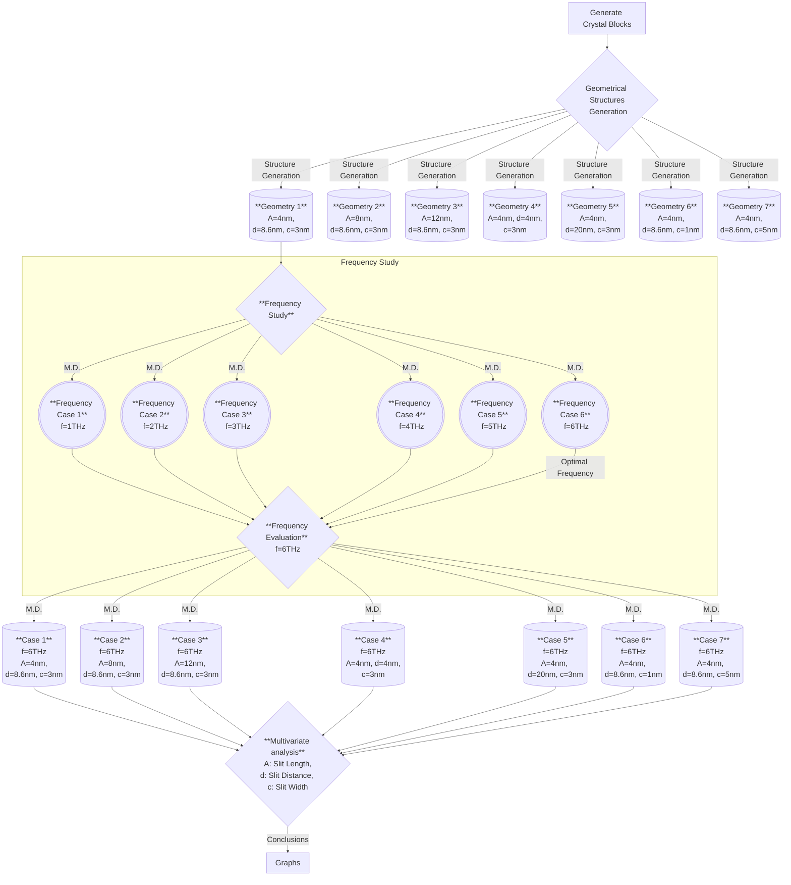

```mermaid
%%{init: {'theme': 'default', 'themeVariables': { 'fontSize': '26px', 'fontFamily': 'Arial' }}}%%
flowchart TD;
    A[Generate Crystal Blocks]--> B{Geometrical Structures<br> Generation}
    B-->|Structure Generation|G1[(**Geometry 1**<br> A=4nm, d=8.6nm, c=3nm)]
    B-->|Structure Generation|G2[(**Geometry 2**<br> A=8nm, d=8.6nm, c=3nm)]
    B-->|Structure Generation|G3[(**Geometry 3**<br> A=12nm, d=8.6nm, c=3nm)]
    B-->|Structure Generation|G4[(**Geometry 4**<br> A=4nm, d=4nm, c=3nm)]
    B-->|Structure Generation|G5[(**Geometry 5**<br> A=4nm, d=20nm, c=3nm)]
    B-->|Structure Generation|G6[(**Geometry 6**<br> A=4nm, d=8.6nm, c=1nm)]
    B-->|Structure Generation|G7[(**Geometry 7**<br> A=4nm, d=8.6nm, c=5nm)]
    G1-->F0{**Frequency Study**<br> }
    
    subgraph Frequency Study
        F0-->|M.D.|F1(((**Frequency Case 1**<br> f=1THz)))
        F0-->|M.D.|F2(((**Frequency Case 2**<br> f=2THz)))
        F0-->|M.D.|F3(((**Frequency Case 3**<br> f=3THz)))
        F0-->|M.D.|F4(((**Frequency Case 4**<br> f=4THz)))
        F0-->|M.D.|F5(((**Frequency Case 5**<br> f=5THz)))
        F0-->|M.D.|F6(((**Frequency Case 6**<br> f=6THz)))
        F1-->FED0
        F2-->FED0
        F3-->FED0
        F4-->FED0
        F5-->FED0
        F6-->|Optimal Frequency|FED0
    end

    FED0{**Frequency Evaluation** <br>f=6THz}-->|M.D.|C1[(**Case 1**<br> f=6THz <br> A=4nm, d=8.6nm, c=3nm)]
    FED0{**Frequency Evaluation** <br>f=6THz}-->|M.D.|C2[(**Case 2**<br> f=6THz <br> A=8nm, d=8.6nm, c=3nm)]
    FED0{**Frequency Evaluation** <br>f=6THz}-->|M.D.|C3[(**Case 3**<br> f=6THz <br> A=12nm, d=8.6nm, c=3nm)]
    FED0{**Frequency Evaluation** <br>f=6THz}-->|M.D.|C4[(**Case 4**<br> f=6THz <br> A=4nm, d=4nm, c=3nm)]
    FED0{**Frequency Evaluation** <br>f=6THz}-->|M.D.|C5[(**Case 5**<br> f=6THz <br>A=4nm, d=20nm, c=3nm)]
    FED0{**Frequency Evaluation** <br>f=6THz}-->|M.D.|C6[(**Case 6**<br> f=6THz <br>A=4nm, d=8.6nm, c=1nm)]
    FED0{**Frequency Evaluation** <br>f=6THz}-->|M.D.|C7[(**Case 7**<br> f=6THz <br>A=4nm, d=8.6nm, c=5nm)]

    FED1{**Multivariate analysis**<br> A: Slit Length, d: Slit Distance, c: Slit Width} 
    C1-->FED1
    C2-->FED1
    C3-->FED1
    C4-->FED1
    C5-->FED1
    C6-->FED1
    C7-->FED1
    FED1-->|Conclusions|FED2[Graphs]
```